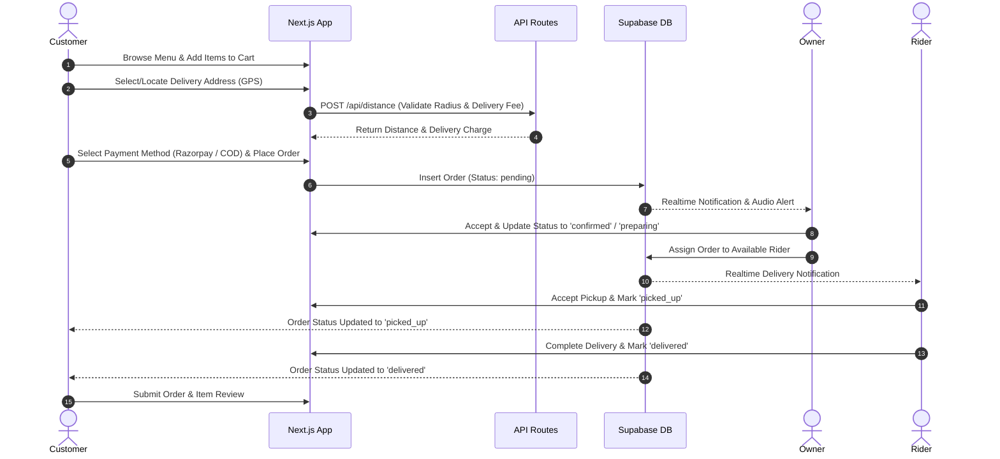
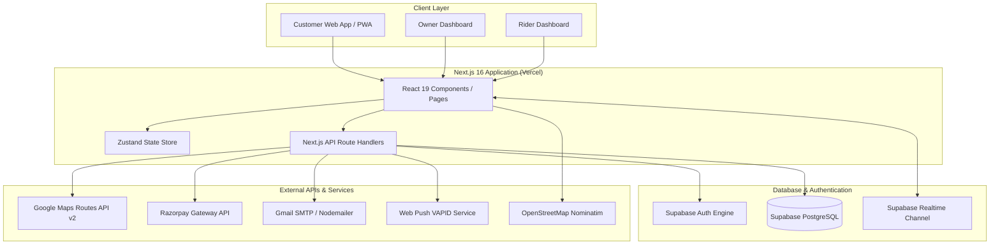

# 🍽️ Royals Zaika — Full-Stack Restaurant Ordering & Delivery Platform

[](https://nextjs.org/)
[](https://reactjs.org/)
[](https://www.typescriptlang.org/)
[](https://supabase.com/)
[](https://tailwindcss.com/)
[](https://royals-zaika-website.vercel.app)
[](https://royals-zaika-website.vercel.app)

A production-grade, full-stack online food ordering, management, and real-time delivery platform engineered for **Royals Zaika** restaurant operations. Built with Next.js 16 (App Router), React 19, Supabase (PostgreSQL & Realtime), Zustand, and Tailwind CSS.

---

## 📌 Overview

**Royals Zaika** is an end-to-end, multi-role digital ecosystem built to solve real-world restaurant business challenges. Rather than being a simple frontend UI template, this platform digitizes and connects all three core operational pillars of food delivery:

1. **Customers** — Seamless food discovery, smart delivery address geocoding, distance-based dynamic delivery pricing, promo code validation, dual payment processing (Online/COD), real-time order status tracking, customer reviews, and a 4-digit PIN / OTP account recovery mechanism.
2. **Restaurant Owners** — High-efficiency management dashboard featuring real-time audio order alerts, order processing workflows (Accept $\rightarrow$ Prepare $\rightarrow$ Ready $\rightarrow$ Dispatch), live delivery partner assignment, menu item CRUD operations, customizable per-km delivery fee tiers, store timing controls, analytics charts, and promotional coupon creation.
3. **Delivery Partners (Riders)** — Dedicated mobile-first rider portal providing active delivery request acceptance, live location sharing, shift scheduling, leave management, and automated earnings breakdown.

---

## 🌐 Live Demo & Repository

- 🔗 **Live Application**: [https://royals-zaika-website.vercel.app](https://royals-zaika-website.vercel.app)
- 🐙 **GitHub Repository**: [https://github.com/harvansh123/royals-zaika-website](https://github.com/harvansh123/royals-zaika-website)

---

## ✨ Key Features

### 👤 Customer Features
- **Dynamic Menu & Filtering**: Browse categories, filter by Veg/Non-Veg, search by dish name, view spice levels, bestseller tags, and preparation times.
- **Location-Based Address Geocoding**: OpenStreetMap Nominatim reverse-geocoding for one-tap current GPS location detection alongside custom address management.
- **Smart Delivery Pricing**: Distance validation against restaurant location using Google Maps Routes API v2 with Haversine fallback and custom per-km delivery fee calculation.
- **Cart & Checkout Engine**: Persistent cart powered by Zustand, instruction notes for kitchen, dynamic delivery charge calculation, and coupon discount application.
- **Dual Payment Integration**: Online payment processing via Razorpay Gateway integration as well as Cash on Delivery (COD).
- **Real-Time Order Tracking**: Multi-step visual tracking pipeline (`pending` $\rightarrow$ `confirmed` $\rightarrow$ `preparing` $\rightarrow$ `ready` $\rightarrow$ `picked_up` $\rightarrow$ `delivered`).
- **Referral & Loyalty Rewards**: Milestone-based referral program generating unique user codes with progressive reward discounts.
- **Item & Order Review System**: Post-delivery feedback with star ratings, item-level ratings, photo uploads, and owner reply visibility.
- **Account Security & Recovery**: Mobile-based login with password recovery via **4-digit bcrypt-hashed Recovery PIN** or **OTP-verified Recovery Email** (Gmail SMTP via Nodemailer).
- **PWA & Push Notifications**: Installable web application with offline service worker support and Web Push notifications for order updates.

### 👨‍💼 Restaurant Owner Dashboard
- **Live Order Command Center**: Real-time incoming order queue with continuous audio/ringtone alerts, single-click order acceptance, status progression, and cancellation handling.
- **Rider Dispatch System**: Manual and automatic delivery partner assignment to ready orders.
- **Menu & Category Control**: Create, update, toggle availability, set veg/non-veg status, upload dish images, and manage category sorting.
- **Delivery Settings & Per-KM Pricing**: Configure base delivery charges, per-km rates, free delivery thresholds, and maximum delivery radius limits.
- **Analytics & Revenue Insights**: Interactive visual charts (Recharts) detailing daily/monthly revenue trends, total orders, average order value, and top-selling items.
- **Coupon & Offer Management**: Create percentage or fixed discount promo codes with minimum cart criteria, maximum discount caps, and validity windows.
- **Store Hours & Availability**: Online/offline store status toggle and shift timing scheduler.
- **Customer Review Moderation**: View customer ratings and post official owner responses.

### 🛵 Rider (Delivery Partner) Dashboard
- **Active Delivery Portal**: Dedicated interface for riders to view assigned deliveries, customer addresses, phone numbers, and delivery notes.
- **Availability Toggle**: Real-time online/offline status control.
- **Status Updates**: One-tap order lifecycle progression (`Picked Up` $\rightarrow$ `Delivered`).
- **Shift & Leave Management**: Set working shift hours and log planned leaves/days off.
- **Rider Earning Analytics**: Transparent tracking of total completed deliveries and earned payouts labeled as "Rider Earning".

---

## 🧭 Complete Order Flow



---

## 🏗️ System Architecture



---

## 🛠️ Technology Stack

| Category | Technology | Usage & Purpose |
|---|---|---|
| **Framework** | Next.js `16.2.6` (App Router, Turbopack) | Full-stack React framework with SSR, Server Components & Route Handlers |
| **UI Library** | React `19.0.0` | Core UI engine |
| **Language** | TypeScript `5.9.3` | Type safety across API payloads, database models, and components |
| **Styling** | Tailwind CSS `3.4.1`, Vanilla CSS | Utility-first responsive design, dark theme tokens, glassmorphism UI |
| **State Management** | Zustand `5.0.2` | Lightweight global cart, auth, and order state management |
| **Form & Validation** | React Hook Form `7.54.2`, Zod `3.24.1` | Form schema validation and state management |
| **Icons & Motion** | Lucide React `0.469.0`, Framer Motion `11.15.0` | UI iconography and micro-interactions |
| **Data Visualization**| Recharts `2.13.3` | Revenue analytics and order trends in Owner Dashboard |
| **Database & Auth** | Supabase (`@supabase/supabase-js` `2.45.4`, `@supabase/ssr` `0.5.2`) | PostgreSQL database, Auth engine, and WebSocket Realtime subscriptions |
| **Maps & Geocoding**| Google Maps Routes API v2 (`@react-google-maps/api`), OpenStreetMap | Distance calculations, road routes, and reverse geocoding |
| **Payments** | Razorpay SDK `2.9.4` | Online payment order creation and signature verification |
| **Email & Security** | Nodemailer `9.0.1`, bcryptjs `3.0.3` | Gmail SMTP email dispatch (Password Reset / OTP) & 4-digit PIN hashing |
| **PWA & Notifications**| Next-PWA `5.6.0`, Web-Push `3.6.7` | Service Worker caching, manifest configuration, and VAPID push notifications |
| **Deployment** | Vercel | Production hosting, CI/CD pipeline, and serverless edge functions |

---

## 🗄️ Database Schema & Architecture

The database is built on **Supabase PostgreSQL** with structured relational integrity, foreign key constraints, and custom Row Level Security (RLS) policies.

```
       +------------------+
       |      users       |
       +------------------+
         | (1)        | (1)
         |            +-----------------------+
         v (N)                                v (N)
  +---------------+                    +------------------+
  |   addresses   |                    |     orders       |
  +---------------+                    +------------------+
                                         | (1)   | (1)  | (1)
                   +---------------------+       |      +---------------------+
                   | (N)                         v (N)                        | (N)
         +-------------------+           +-------------------+       +--------------------+
         |    order_items    |           | delivery_tracking |       |   order_reviews    |
         +-------------------+           +-------------------+       +--------------------+
                   | (N)                                                       | (1)
                   v (1)                                                       v (N)
         +-------------------+                                       +--------------------+
         |    menu_items     |                                       | review_item_ratings|
         +-------------------+                                       +--------------------+
                   | (N)
                   v (1)
         +-------------------+
         |    categories     |
         +-------------------+
```

### Key Database Tables

- **`users`**: User profile details (`name`, `email`, `phone`, `role`: `customer`/`restaurant_owner`/`delivery`/`admin`, `recovery_pin_hash`, `recovery_email`, `reset_token_hash`).
- **`addresses`**: Saved delivery addresses with latitude/longitude coordinates and default status.
- **`categories`**: Menu categories (`name`, `slug`, `icon`, `sort_order`, `is_active`).
- **`menu_items`**: Food menu items (`name`, `price`, `discounted_price`, `is_veg`, `is_available`, `is_bestseller`, `spice_level`, `preparation_time`).
- **`coupons`**: Discount promo codes (`code`, `discount_type`, `discount_value`, `min_order_amount`, `max_discount`, `valid_until`).
- **`orders`**: Master order tracking record (`order_number`, `user_id`, `status`, `payment_method`, `payment_status`, `subtotal`, `delivery_fee`, `discount_amount`, `total_amount`).
- **`order_items`**: Line items snapshot per order preserving price and quantity at time of purchase.
- **`payments`**: Payment records storing Razorpay order/payment IDs or COD indicators.
- **`delivery_partners`**: Rider profiles (`vehicle_type`, `vehicle_number`, `is_available`, `current_lat`, `current_lng`, `rating`).
- **`delivery_tracking`**: Live order delivery status linked to specific delivery partners.
- **`order_reviews`**: Detailed post-delivery customer reviews (`overall_rating`, `food_quality_rating`, `taste_rating`, `packaging_rating`, `delivery_rating`, `owner_reply`).
- **`referrals` & `referral_rewards`**: Referral tracking and milestone reward allocations.

---

## 🔐 Authentication & Security

- **Multi-Role RBAC**: Strict role distinction between `customer`, `restaurant_owner`, `delivery`, and `admin`.
- **Customer Phone Authentication**: Streamlined mobile login/signup with system-generated identifier handling.
- **Account Recovery System**:
  1. **4-Digit Recovery PIN**: Stored as a `bcryptjs` hash (`cost=10`). Never stored in plain text.
  2. **Verified Recovery Email**: OTP-verified recovery email (Gmail SMTP) with SHA-256 hashed 1-hour expiration reset tokens.
- **Rate-Limiting & Security Headers**: In-memory rate-limiting on authentication recovery endpoints to prevent brute-force attacks.

---

## 📍 Delivery Radius & Distance Calculation

1. **Precision Geofencing**: Validates customer coordinates against restaurant coordinates during checkout.
2. **Google Maps Routes API v2**: Computes actual road driving distance (`routes.distanceMeters`) for exact pricing calculation.
3. **In-Memory Distance Cache**: Caches coordinate pair distances in server instance memory to minimize API latency and quota consumption.
4. **Haversine Straight-Line Fallback**: Automatically falls back to mathematical Haversine distance calculation if the Google API is unreachable or unconfigured.

---

## 💰 Payment Gateway Integration

- **Razorpay Online Payment**: Server-side order generation via `/api/razorpay/create-order` returning Razorpay Order IDs for frontend SDK checkout popup.
- **Cash on Delivery (COD)**: Complete offline payment lifecycle handling where payment status is marked as `paid` upon delivery by the rider or owner.

---

## 📂 Project Structure

```
royals-zaika-website/
├── public/                     # Static assets, PWA icons, manifest, service worker
│   ├── icons/                  # PWA app icons
│   ├── manifest.json           # Web app manifest configuration
│   └── sw.js                   # Service Worker implementation
├── screenshots/                # Application screenshot documentation
├── src/
│   ├── app/                    # Next.js App Router Structure
│   │   ├── (public)/           # Customer facing routes (Home, Menu, Cart, Checkout, Profile, Track)
│   │   ├── admin/              # Admin administrative panel
│   │   ├── api/                # Next.js API route handlers
│   │   │   ├── auth/           # Forgot password, reset, PIN, recovery endpoints
│   │   │   ├── customer/       # Customer profile & address endpoints
│   │   │   ├── distance/       # Google Maps Routes API v2 / Haversine endpoint
│   │   │   ├── owner/          # Owner analytics, orders & menu CRUD endpoints
│   │   │   ├── razorpay/       # Razorpay order creation endpoint
│   │   │   ├── referral/       # Referral code & reward endpoints
│   │   │   └── rider/          # Rider status, location & stats endpoints
│   │   ├── auth/               # Login, Forgot Password, Reset Password UI pages
│   │   ├── delivery/           # Delivery Partner / Rider Dashboard
│   │   └── owner/              # Restaurant Owner Management Dashboard
│   ├── components/             # Reusable UI components
│   │   ├── auth/               # Auth forms & RecoverySetupPopup modal
│   │   ├── cart/               # Cart drawers, items & address selection
│   │   ├── layout/             # Navbar, Footer, Mobile Bottom Navigation
│   │   ├── menu/               # Menu cards, search & category filters
│   │   ├── reviews/            # Order review dialogs & star ratings
│   │   └── support/            # Support ticket modals
│   ├── lib/                    # Core utilities & database types
│   │   ├── database.types.ts   # Auto-generated Supabase TypeScript definitions
│   │   ├── email.ts            # Shared Nodemailer Gmail SMTP helper
│   │   ├── haversine.ts        # Geolocation distance formula
│   │   ├── supabase/           # Supabase browser & server SSR clients
│   │   └── utils.ts            # Formatting, phone validation, helper functions
│   └── stores/                 # Zustand stores (cartStore, authStore)
├── supabase/                   # Database SQL migrations & configuration
├── .env.local.example          # Environment variable template
├── next.config.ts              # Next.js & PWA configuration
├── package.json                # Dependencies and project scripts
├── tailwind.config.js          # Tailwind styling configuration
└── tsconfig.json               # TypeScript compiler configuration
```

---

## 🖼️ Screenshots

Place actual screenshots of your running instance in the `screenshots/` directory:

| Section | Screenshot Placeholder |
|---|---|
| **Homepage** | `screenshots/homepage.png` |
| **Interactive Menu** | `screenshots/menu.png` |
| **Cart & Address Geocoding** | `screenshots/cart-checkout.png` |
| **Order Tracking Pipeline** | `screenshots/order-tracking.png` |
| **Owner Dashboard & Analytics** | `screenshots/owner-dashboard.png` |
| **Rider Delivery Dashboard** | `screenshots/rider-dashboard.png` |

---

## ⚙️ Local Development Setup

### Prerequisites
- **Node.js**: `v18.0.0` or higher
- **npm**: `v9.0.0` or higher
- **Supabase Account**: A free Supabase project instance

### Installation Steps

1. **Clone the repository**:
   ```bash
   git clone https://github.com/harvansh123/royals-zaika-website.git
   cd royals-zaika-website
   ```

2. **Install dependencies**:
   ```bash
   npm install
   ```

3. **Configure Environment Variables**:
   Copy `.env.local.example` to `.env.local`:
   ```bash
   cp .env.local.example .env.local
   ```

4. **Fill in `.env.local` keys**:
   ```env
   # Supabase Configuration
   NEXT_PUBLIC_SUPABASE_URL=https://your-project.supabase.co
   NEXT_PUBLIC_SUPABASE_ANON_KEY=your-supabase-anon-key
   SUPABASE_SERVICE_ROLE_KEY=your-supabase-service-role-key

   # Google Maps API (Optional for exact road distance)
   NEXT_PUBLIC_GOOGLE_MAPS_API_KEY=your-google-maps-key

   # Razorpay Payment Gateway
   NEXT_PUBLIC_RAZORPAY_KEY_ID=your-razorpay-key-id
   RAZORPAY_KEY_SECRET=your-razorpay-key-secret

   # Email Recovery (Gmail SMTP)
   GMAIL_USER=your-gmail-address@gmail.com
   GMAIL_APP_PASSWORD=your-gmail-app-password

   # App Information
   NEXT_PUBLIC_APP_URL=http://localhost:3000
   NEXT_PUBLIC_RESTAURANT_NAME=Royals Zaika
   ```

5. **Run Database Migrations**:
   Execute the migration SQL scripts located in `supabase/` or root SQL artifacts within your Supabase SQL Editor.

6. **Start the local development server**:
   ```bash
   npm run dev
   ```

7. **Open Application**:
   Navigate to [http://localhost:3000](http://localhost:3000) in your web browser.

---

## 🚀 Deployment

The project is configured for seamless zero-downtime deployment on **Vercel**:

1. Push your changes to the `main` branch on GitHub.
2. Link the repository in the Vercel Dashboard.
3. Add environment variables in Vercel Project Settings.
4. Vercel automatically builds and deploys serverless API routes and dynamic pages.

---

## 🧠 Key Technical Engineering Challenges

1. **Multi-Role RLS & Recursion Prevention**: Designed custom API service-role endpoints for user updates to avoid infinite loops caused by Supabase Row Level Security policies querying user roles.
2. **Hybrid Distance Calculation**: Built a resilient distance calculator using Google Routes API v2 with in-memory caching and fallback straight-line Haversine math to ensure checkout never fails if map APIs rate-limit or fail.
3. **Realtime Multi-Dashboard Sync**: Utilized Supabase Realtime WebSocket subscriptions to instantly reflect order status updates across Customer Tracking, Owner Alert Queues, and Rider portals simultaneously.
4. **Secure Password Recovery without Plain-Text Storage**: Designed a dual-option recovery mechanism leveraging 4-digit bcrypt-hashed PINs and timed OTP email links via Gmail SMTP.

---

## 📚 What I Learned

- **Architecting Full-Stack Next.js 16 Apps**: Leveraging App Router features, server-side data fetching, and API route handlers for production applications.
- **Relational Schema & Security**: Designing complex relational PostgreSQL databases in Supabase with RLS rules, foreign keys, and indexes.
- **State Optimization**: Managing cart states, checkout steps, and user sessions using Zustand for immediate UI responses.
- **Third-Party Service Integration**: Implementing Razorpay payments, Google Maps APIs, Nodemailer Gmail SMTP, and Web Push services.

---

## 🔮 Future Improvements

- [ ] **Live GPS Driver Map**: Real-time driver location marker moving along Google Maps polyline routes during delivery.
- [ ] **Automated Smart Dispatch**: Algorithm to auto-assign incoming orders to the nearest available rider based on location proximity.
- [ ] **Multi-Branch Support**: Scale system architecture to support multiple restaurant branches with location-based menu routing.

---

## 👨‍💻 Developer Information

- **Name**: Harvansh Chaurasia
- **GitHub**: [@harvansh123](https://github.com/harvansh123)
- **Live Application**: [Royals Zaika Website](https://royals-zaika-website.vercel.app)

---

## 🛡️ Security Note

> **IMPORTANT**: Sensitive environment variables, API secrets, Supabase Service Role keys, and passwords must never be committed to source control. Always maintain confidential credentials inside `.env.local` or host secret management systems.

---

## ⭐ Show Your Support

If you found this repository helpful or inspiring, please consider giving it a **Star** ⭐️ on GitHub!
